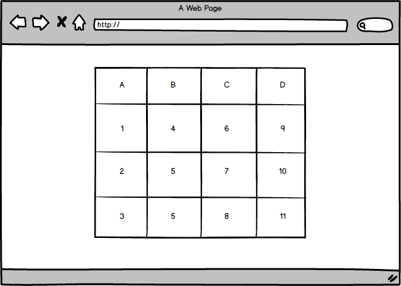
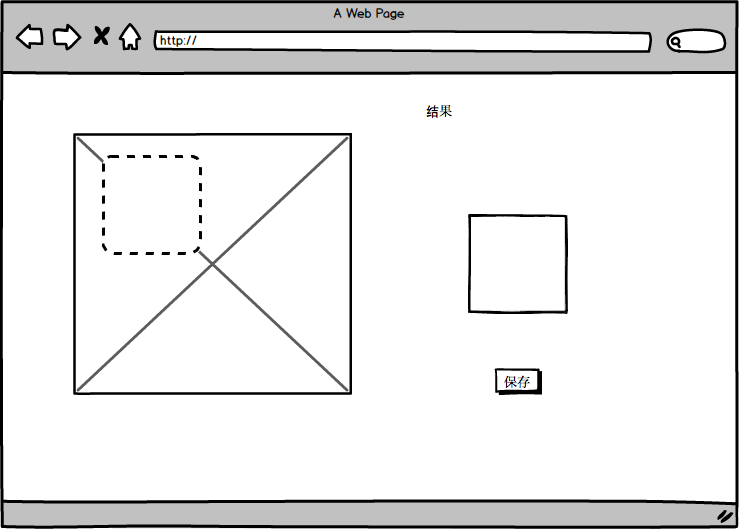

# 挖财前端笔试题

笔试题共两道，一个礼拜内完成，技术、框架不限，每道题可自行扩展需求。

## 1.十六宫格换位

#### 需求说明：

I. 拖动 A 单元格与 1 单元格交换，A 行与 1 行整行交换，以此类推。

II. 拖动 A 单元格与 B 单元格交换，A 列与 B 列整列交换，以此类推。

III. 拖动 3 单元格与 6 单元格交换，3 单元格 与 6 单元格交换，以此类推。

IV. 具体样式及交互细节可自行决定。

V. pd 稿见附件

## 2. 图片裁切

#### 需求说明：

I. 给定一张图片（可用户上传也可固定图片）。

II. 初始时已有正方形虚线框，可自由拖拽（位置可变，大小固定）。

III. 虚线框内的图片实时显示到结果框中，结果框与虚线框大小相同。

IV. 点击保存执行上传，可模拟也可完成服务端实现。

V. 具体样式及交互细节可自行决定。

VI. pd 稿见附件。

